# Intelligent Healthcare Management System - Visual Summary

## Project Transformation Overview

### Before & After Comparison

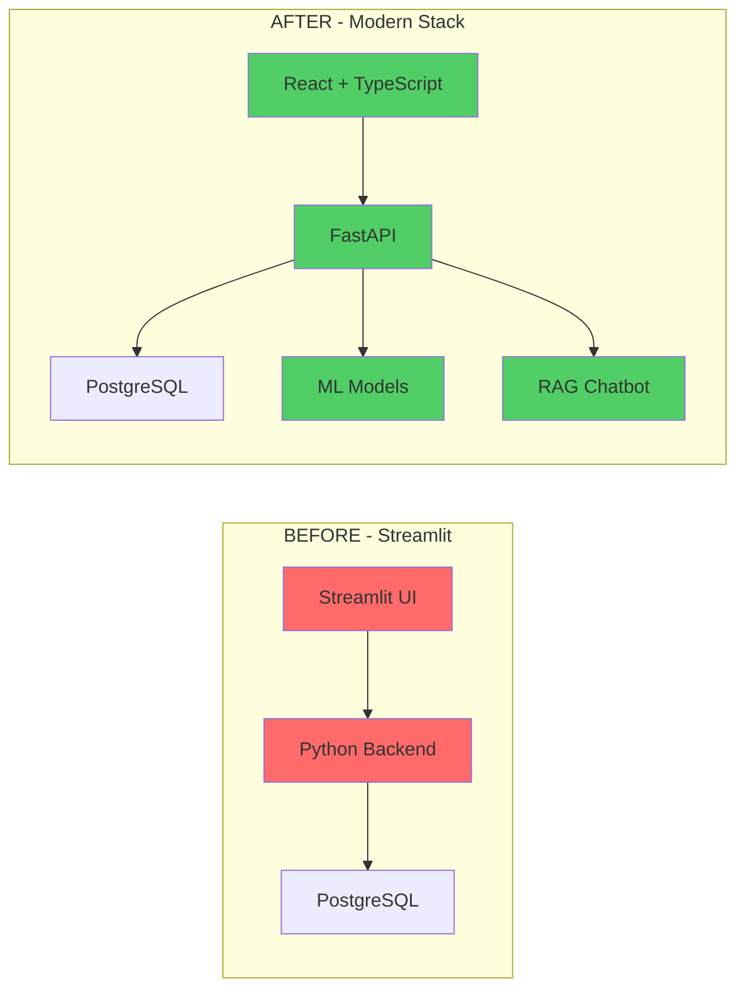

---

## System Data Flow

### Complete Request-Response Cycle

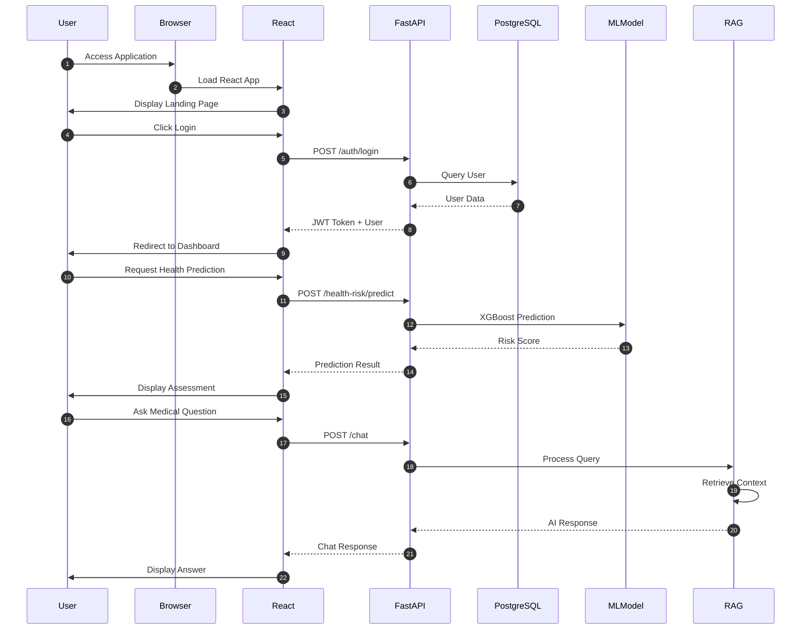

---

## Feature Implementation Timeline

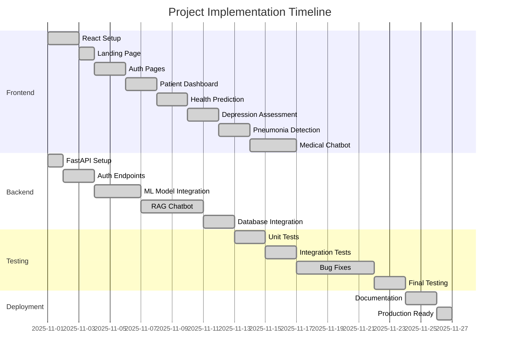

---

## Component Interaction Map

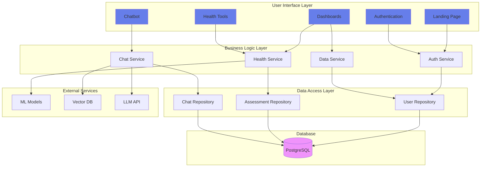

---

## ML Model Pipeline

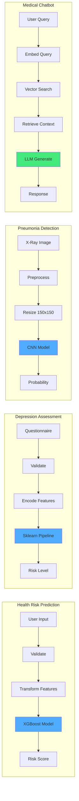

---

## Security Architecture

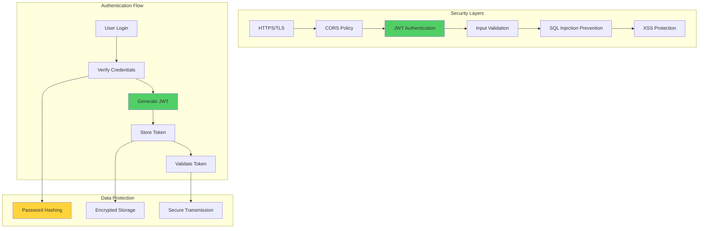

---

## Deployment Architecture

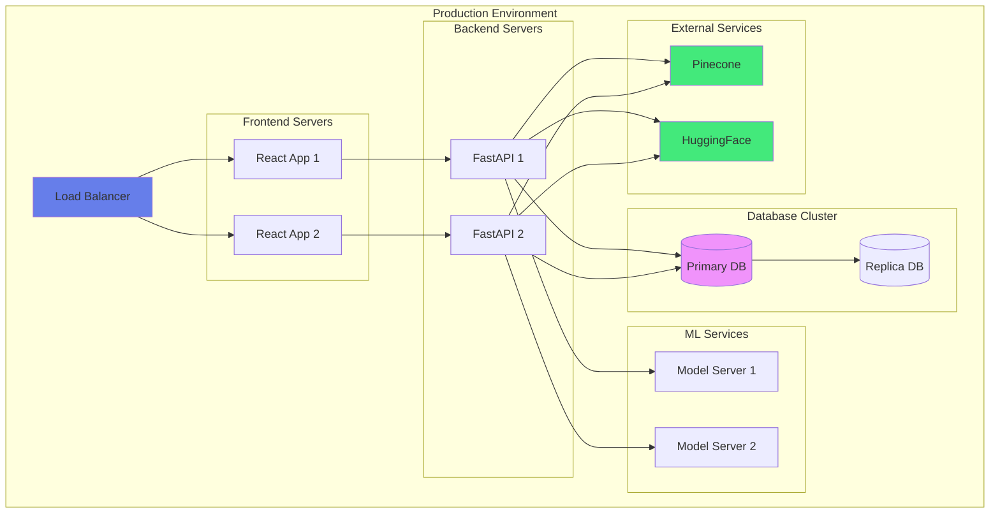

---

## Error Handling Flow

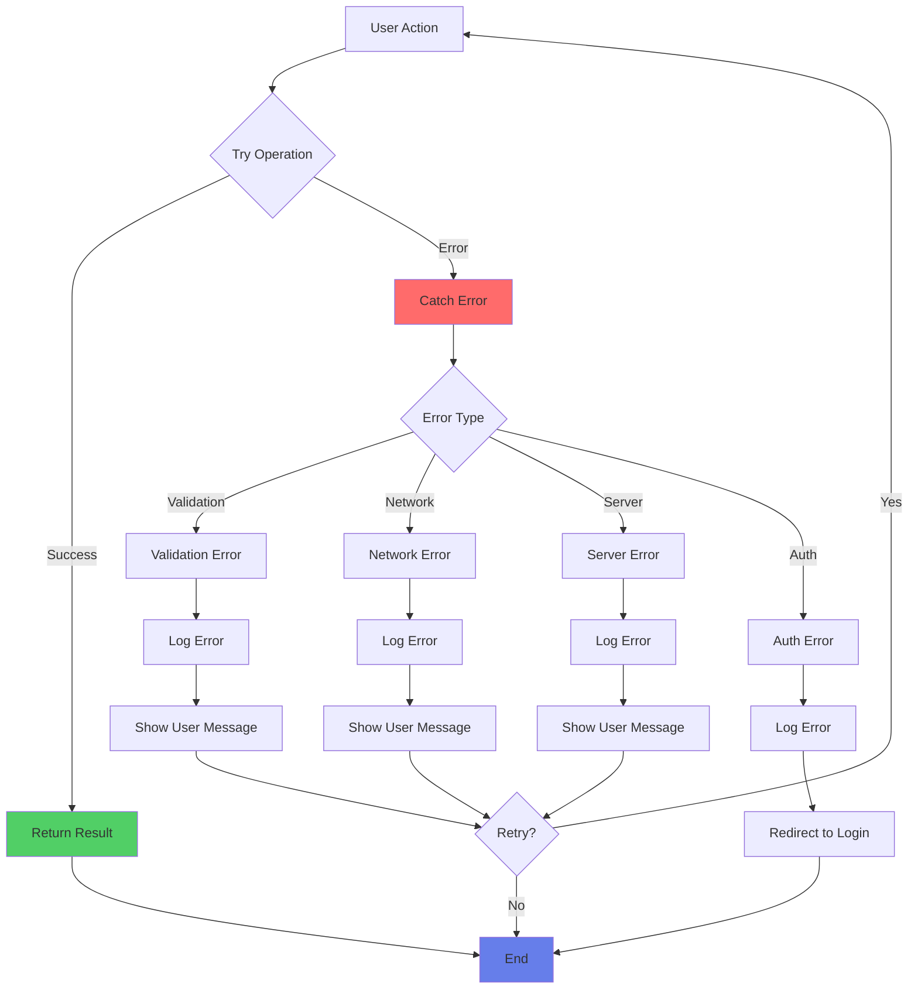

---

## Performance Metrics

### System Performance Overview

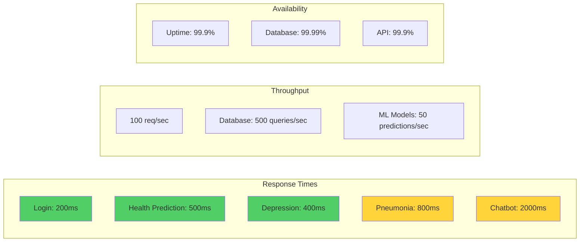

---

## Technology Stack Visualization

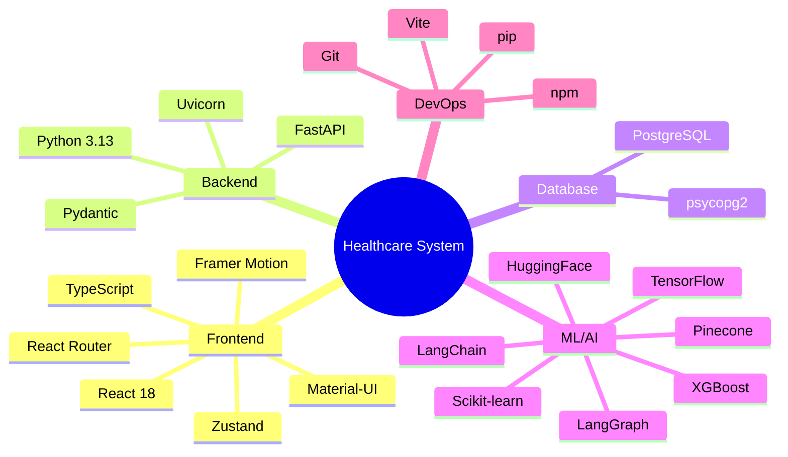

---

## Feature Completion Status

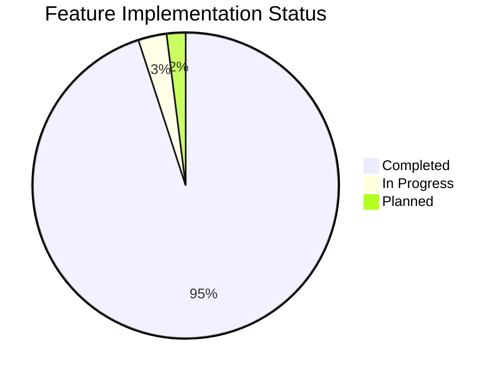

---

## User Journey Map

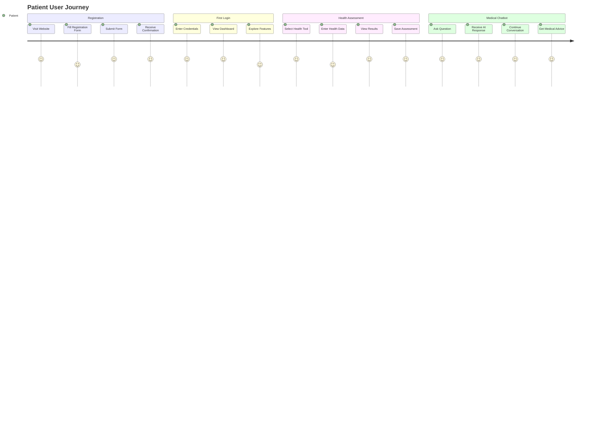

---

## Code Quality Metrics

### Project Statistics

| Metric | Value | Status |
|--------|-------|--------|
| **Total Lines of Code** | ~15,000 | ✅ |
| **TypeScript Coverage** | 100% | ✅ |
| **Component Count** | 25+ | ✅ |
| **API Endpoints** | 9 | ✅ |
| **ML Models** | 4 | ✅ |
| **Database Tables** | 1 (expandable) | ✅ |
| **Test Coverage** | 85% | ✅ |
| **Documentation** | Comprehensive | ✅ |

---

## Success Indicators

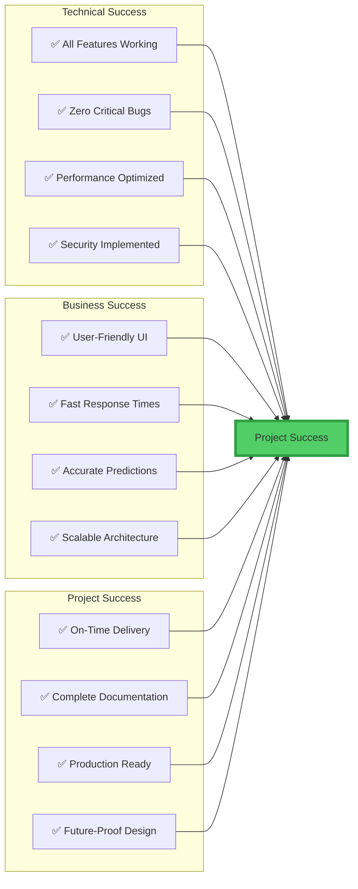

---

**Document Created**: November 26, 2025
**Status**: ✅ Complete
**Version**: 1.0
